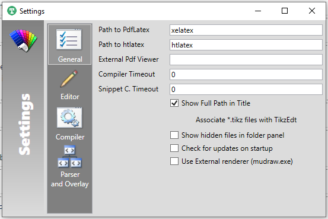

# docs-diagrams

## Writer (Windows Setup)
### Setup

1. Install [MiKTeX](https://miktex.org/download)
2. Install [TikzEdt](http://tikzedt.org/) (There is a [portable version](https://storage.googleapis.com/google-code-archive-downloads/v2/code.google.com/tikzedt/TikzEdtBeta0_2_3.zip) for regular users, i.e. no admin rights required).
3. In the TikzEdt settings, set the default from `pdflatex` to `xelatex` (needed for the custom font)



## Build System
### Requirements
1. texlive (xelatex)
2. [GNU Make](http://gnuwin32.sourceforge.net/packages/make.htm)
3. [cairo](https://www.cairographics.org/)

### Build
Run
```
make
# or
make -j 8
```
and the diagrams will be in `out/`.

### Docker
Github Actions uses the Docker image `wirecardtecdoc/texlive:cairo` from [here](https://github.com/wirecard/docs-dockerfile/docs-diagrams/).

## Variable export from Asciidoctor
This repository includes utility scripts to export Asciidoctor variables from `shortcuts.adoc` to generate a Latex file which contains the same variables.
Latex variable names are very restricted, this is why Ruby *humanize* is needed.

### Requirements
* Ruby
  * humanize (translate numbers to words, because Latex variables cannot contain digits)

### Run
```sh
ruby scripts/export-vars.rb
```
